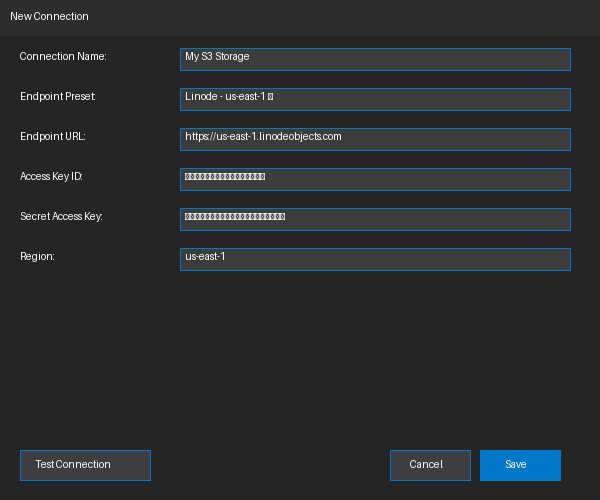
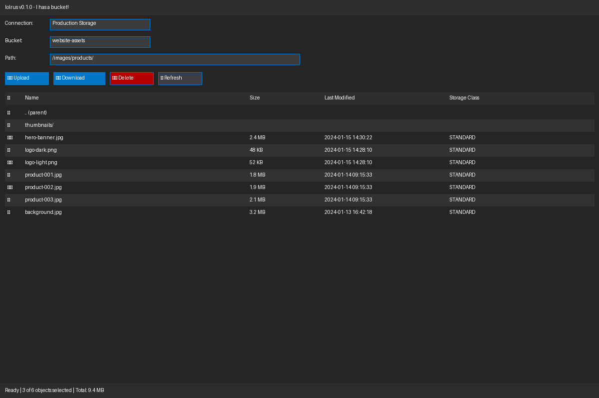
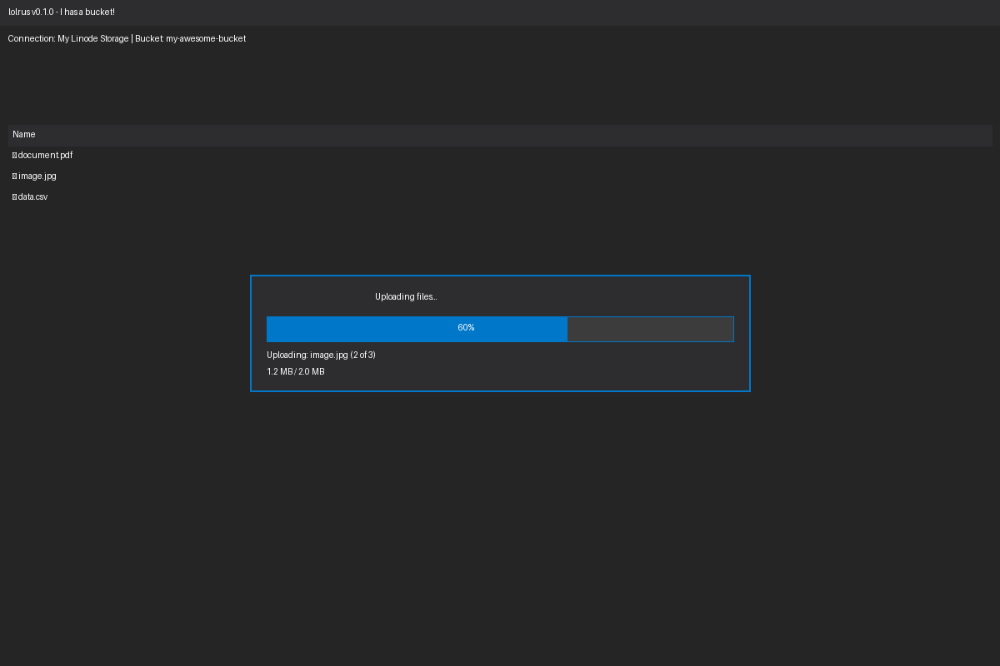
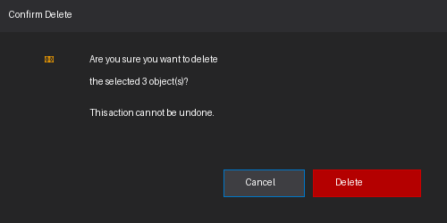
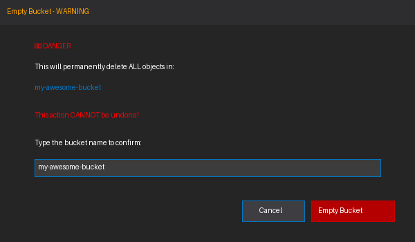

# 🦭 lolrus

**I has a bucket!**

A desktop S3-compatible object storage browser built with [DearPyGui](https://github.com/hoffstadt/DearPyGui).


## Features

- 🪣 **Multi-provider support** - Connect to any S3-compatible storage (Linode, AWS, DigitalOcean, Backblaze B2, MinIO, Cloudflare R2, etc.)
- 🔐 **Secure credential storage** - Credentials are stored in your system's native keyring (Windows Credential Manager, macOS Keychain, Linux Secret Service)
- 📁 **Browse objects** - Navigate bucket contents with folder-style hierarchy
- ⬆️ **Upload files** - Upload files with progress tracking
- ⬇️ **Download files** - Download single or multiple files
- 🗑️ **Delete objects** - Single or bulk delete with confirmation
- 🔥 **Empty bucket** - Nuclear option to delete ALL objects (requires typing bucket name to confirm)
- 📊 **Async operations** - All long-running operations happen in the background with progress indication

## Installation

### Pre-built binaries

Download the latest release for your platform from the [Releases](https://github.com/zimventures/lolrus/releases) page.

| Platform | Download |
|----------|----------|
| Windows (x64) | `lolrus-windows-x86_64.exe` |
| Linux (x64) | `lolrus-linux-x86_64` |
| macOS (Intel) | `lolrus-macos-intel.zip` |
| macOS (Apple Silicon) | `lolrus-macos-arm64.zip` |

### From source

Requires Python 3.10+

```bash
# Clone the repository
git clone https://github.com/zimventures/lolrus.git
cd lolrus

# Install in development mode
pip install -e ".[dev]"

# Run
lolrus
```

## Usage

### Quick Start

1. Launch lolrus
2. Click **New** to create a connection
3. Select a preset endpoint or enter a custom S3-compatible URL
4. Enter your access key and secret key
5. Click **Test Connection** to verify
6. Click **Save**
7. Select your connection from the dropdown
8. Select a bucket to browse

### Connection Presets

lolrus includes presets for common S3-compatible providers:

- Linode Object Storage (multiple regions)
- AWS S3 (us-east-1, us-west-2)
- DigitalOcean Spaces
- Backblaze B2
- MinIO (local development)
- Cloudflare R2

## Getting Started Guide

This visual guide walks you through the key features and workflows in lolrus.

> **Note:** The screenshots below are mockup representations of the UI. We welcome contributions of actual screenshots! See [`assets/screenshots/README.md`](assets/screenshots/README.md) for guidelines on capturing and submitting real screenshots or animated GIFs.

### 1. Main Window Overview

When you first launch lolrus, you'll see the main window with the object browser interface:


The main window consists of:
- **Connection dropdown** - Select your S3 connection
- **Bucket dropdown** - Choose which bucket to browse
- **Path input** - Navigate to specific folders/prefixes
- **Action buttons** - Upload, Download, Delete, Refresh, and Empty Bucket
- **Object table** - Browse files and folders with details (name, size, last modified, storage class)
- **Status bar** - Shows current operation status and selection info

### 2. Creating a New Connection

Click the **New** button to configure a connection to your S3-compatible storage:



**Steps:**
1. Enter a memorable **Connection Name** (e.g., "My Linode Storage")
2. Select an **Endpoint Preset** from the dropdown (or choose "Custom" for other providers)
3. The **Endpoint URL** will auto-fill based on your preset selection
4. Enter your **Access Key ID** and **Secret Access Key**
5. Verify the **Region** matches your storage location
6. Click **Test Connection** to verify your credentials work
7. Click **Save** to store the connection securely (credentials are stored in your system keyring)

### 3. Browsing Objects

Once connected, select a bucket to browse its contents:



**Features:**
- **Folder navigation** - Click on folders (📁) to navigate into them, or use ".." to go back
- **Selection** - Check boxes to select multiple files for batch operations
- **Sorting** - Click column headers to sort by name, size, date, or storage class
- **Visual indicators** - Icons differentiate folders from files
- **Path breadcrumbs** - The path input shows your current location and can be edited directly

### 4. Uploading Files

Click **Upload** to add files to your bucket:



The upload process:
1. Click the **Upload** button
2. Select one or more files from the file picker
3. Watch the progress bar showing:
   - Current file being uploaded
   - Progress percentage
   - Data transferred / Total size
4. Files appear in the bucket immediately after upload completes

**Tip:** On Windows, you can also drag and drop files directly onto the window to upload them!

### 5. Deleting Objects

Select one or more objects and click **Delete**:



**Safety features:**
- Confirmation dialog shows the number of objects to be deleted
- Clear warning that the action cannot be undone
- Cancel button to abort if you change your mind

### 6. Emptying a Bucket

For bulk deletion of all objects in a bucket, use the **Empty Bucket** feature:



**Important safety measures:**
- ⚠️ **DANGER** warning clearly indicates this is a destructive operation
- You must type the exact bucket name to confirm
- Useful for deprovisioning infrastructure or cleaning up test environments
- **This action cannot be undone** - all objects will be permanently deleted

### Additional Features

- **Download** - Select objects and click Download to save them locally
- **Refresh** - Update the object list to see changes made outside lolrus
- **Multiple selections** - Use checkboxes to work with multiple files at once
- **Async operations** - Long operations run in the background with progress tracking
- **Secure credentials** - All credentials are stored in your system's native keyring

## Building

### Local build

```bash
# Install dev dependencies
pip install -e ".[dev]"

# Build with PyInstaller
pyinstaller lolrus.spec --clean

# Output will be in dist/
```

### Cross-platform builds via GitHub Actions

Push a tag to trigger automated builds:

```bash
git tag v0.1.0
git push origin v0.1.0
```

This will create builds for Windows, Linux, and macOS (both Intel and Apple Silicon).

## Development

```bash
# Install in development mode
pip install -e ".[dev]"

# Run linter
ruff check src/

# Run tests
pytest tests/ -v

# Run the app
python -m lolrus
```

## Architecture

```
src/lolrus/
├── __init__.py       # Package metadata
├── __main__.py       # Entry point
├── app.py            # Main DearPyGui application
├── s3_client.py      # boto3 wrapper with async operations
└── connections.py    # Connection management with keyring storage
```

### Key Design Decisions

- **DearPyGui** - GPU-accelerated, pure Python GUI library with minimal dependencies
- **boto3** - AWS SDK provides excellent S3 compatibility
- **keyring** - System-native credential storage (no plaintext passwords)
- **ThreadPoolExecutor** - Background operations don't block the UI
- **PyInstaller** - Single-file executables for easy distribution

## Contributing

Contributions are welcome! Please feel free to submit a Pull Request.

## License

MIT License - see [LICENSE](LICENSE) for details.

## Why "lolrus"?

[It's an old meme, but it checks out.](https://knowyourmeme.com/memes/lolrus)

---

*They be stealin' my bucket!* 🦭
